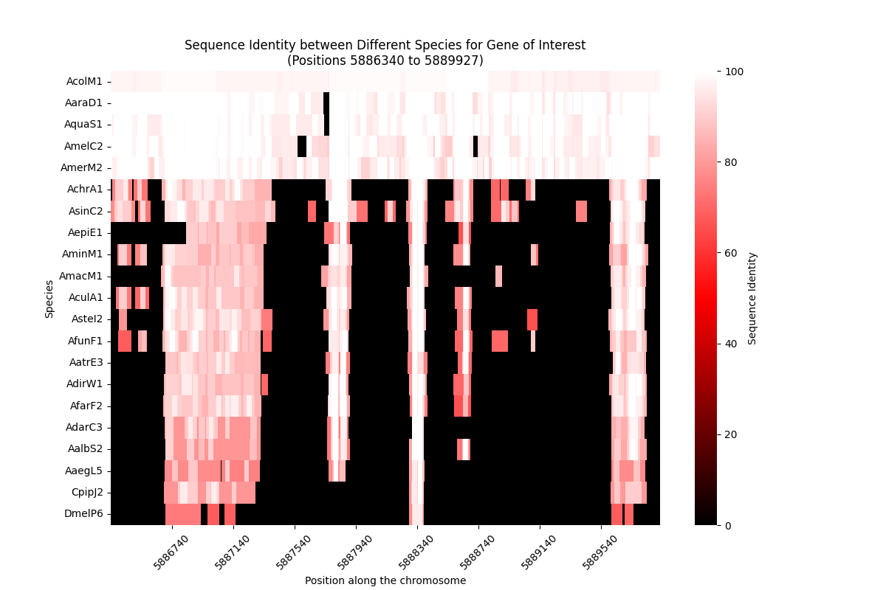

# AgamCs

## Description
This package fetches conservation scores and creates a heatmap based on genomic coordinates.

## Example Usage
```commandline
AgamCs --region 3R:5886340-5889928 --output AGAP008118.png
```


## Setup

### 1. Install the required packages:
```commandline
pip install -r requirements.txt
```

### 2. Download the data file:
Download the `AgamP4_conservation.h5` file from the following link:
[Download AgamP4_conservation.h5](https://zenodo.org/record/4304586/files/AgamP4_conservation.h5)

### 3. Place the data file:
Place the downloaded `AgamP4_conservation.h5` file in the `data` directory within the project.

