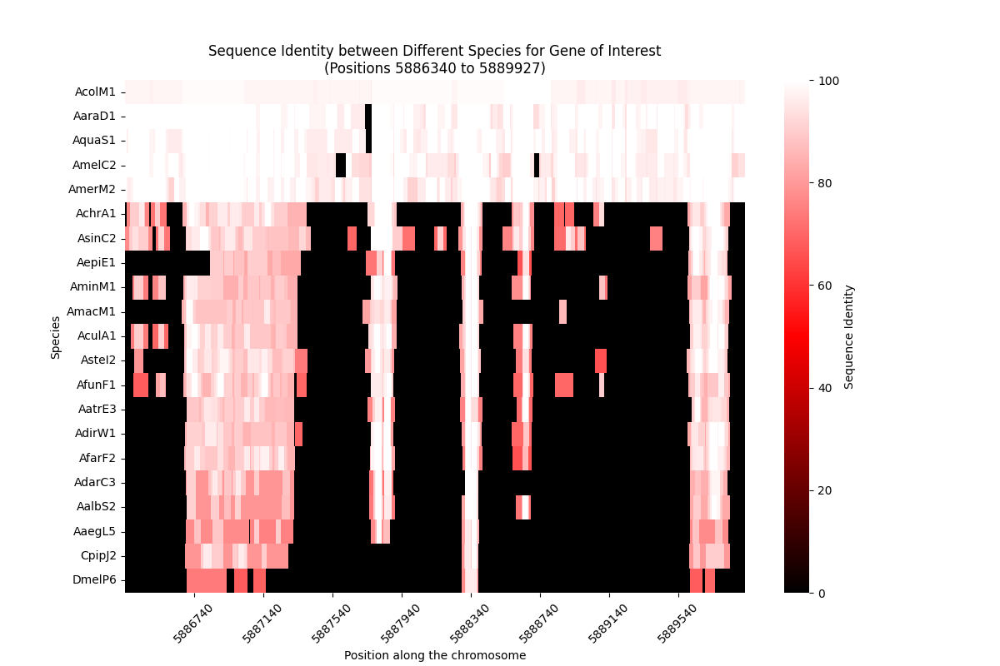

# AgamCs

## Description
This package fetches conservation scores and creates a heatmap based on genomic coordinates.

## Example Usage
```commandline
AgamCs --region 3R:5886340-5889928 --output AGAP008118.png
```


AgamCs now uses the local HDF5 file when it is present and otherwise streams
only the compressed chunks required for the requested interval from the
Zenodo archive:

```commandline
AgamCs --data-source remote --region 3R:5886340-5889928 --output AGAP008118
```

The web prototype requests only the three arrays consumed by its plot: `Cs`,
`snp_density`, and the 21-row `stack`. The CLI retains its six original score
families. Neither mode downloads or caches the full 3.7 GB HDF5 file.

## Batch accession usage

To process genes by accession number, pass one or more `AGAP...` IDs. AgamCs
will query Ensembl/VectorBase to resolve each accession to genomic coordinates
and retrieve its canonical transcript annotation:

```commandline
AgamCs --accessions AGAP008118 AGAP001234 --output accession_batch
```

You can also provide the accessions in a text file, one per line:

```commandline
AgamCs --accessions-file accessions.txt --output accession_batch
```

Each accession is written to its own directory under `results/<output>/`.
Use `--padding 500` to add bases on both sides of accession-derived regions.

Each run keeps the original base-level Cs/SNP plot and also writes a
`*_cs_snp_summary.png` companion. The companion bins the conservation signal,
showing its median with 25th–75th and 10th–90th percentile ribbons, and places
mean SNP density in a separate aligned panel. This makes high local variability
visible as ribbon width rather than as a solid block of connected blue lines.

For accession-based runs, the Cs/SNP plot is oriented from 5′ to 3′ even when
the gene is on the minus strand. Its x-axis is anchored at the transcription
start site (TSS), exon starts, and transcription end site (TES), with an aligned
transcript track showing exons/UTRs and CDS segments. Direct `--region` runs do
not assume a gene; their x-axis starts at 0 bp relative to the plotted interval.
`--highlight` values remain absolute genomic coordinates in both modes.

For offline or pinned-coordinate workflows, you can still provide an annotation
file with `--annotation`. A VectorBase-style GFF3 supplies both coordinates and
the exon/CDS track. A CSV/TSV supplies coordinates only; use either a `region`
column:

```text
accession	region
AGAP008118	3R:5886340-5889928
```

or coordinate columns:

```text
accession	chromosome	start	end
AGAP008118	3R	5886340	5889928
```

## Setup

### 1. Install the required packages:
```commandline
pip install -r requirements.txt
```

### 2. Choose remote or local data

No data download is required for the remote prototype. `--data-source auto`
is the default: it uses a local dataset when one is available, then falls back
to the bundled Kerchunk index and Zenodo range requests.

To work offline, download the archival file:

Download the `AgamP4_conservation.h5` file from the following link:
[Download AgamP4_conservation.h5](https://zenodo.org/record/4304586/files/AgamP4_conservation.h5)

Place the downloaded `AgamP4_conservation.h5` file in the `data` directory within the project.

Force either mode when testing:

```commandline
AgamCs --data-source remote --region 3R:5886340-5889928 --output remote_test
AgamCs --data-source local --region 3R:5886340-5889928 --output local_test
```

### 3. Run the web prototype

The Shiny prototype uses the remote source by default and keeps each browser
session's generated files isolated in a temporary directory:

```commandline
shiny run AgamCs.app:app
```

Open `http://127.0.0.1:8000`, enter an AgamP4 interval, and click **Run**.

## Kerchunk index maintenance

The committed reference JSON contains byte offsets and compression metadata,
not conservation data. It is about 700 KB and points at the immutable Zenodo
record. Rebuild it only when the archived HDF5 source changes:

```commandline
python tools/build_kerchunk_reference.py
```

The generator publishes the CLI's six score arrays by default. It also divides
the otherwise-contiguous `phyloP` byte range into 65,536-base virtual chunks,
so a small remote query does not transfer an entire chromosome. Pass an
explicit list with `--arrays` to build a narrower index. After rebuilding,
compare a remote interval with the local HDF5 before publishing the new index.
