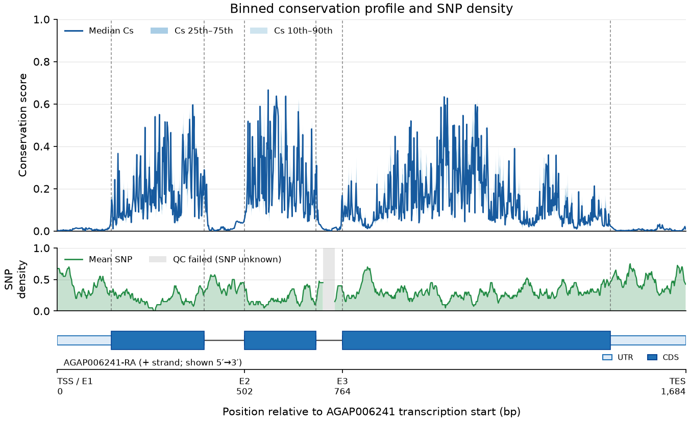
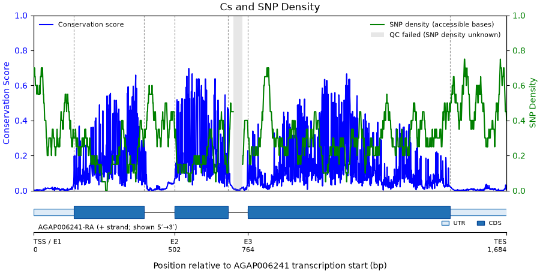
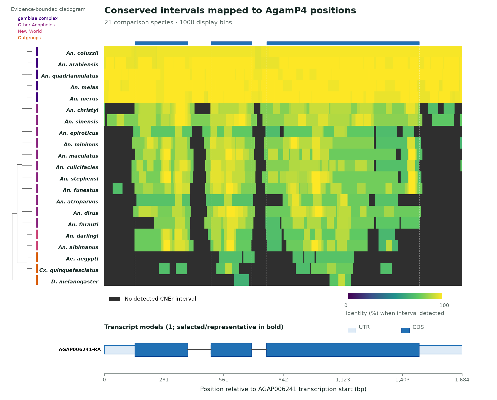

# AgamCs

**Use AgamCs in your browser:** [open the AgamCs research portal](https://tycour.github.io/AgamCs/).

The GitHub Pages portal is the easiest way to find a current AgamP4.14 gene by
official symbol or `AGAP...` accession, query an exact transcript isoform on 2L,
2R, 3L, 3R, or X, or enter AgamP4 genomic coordinates, then inspect the figures
and download exact values.
Either query mode can optionally show a representative transcript for each
indexed gene overlapping the displayed region, with transcript labels linking
to the parent gene's VectorBase record.
The conservation arrays are from the published AgamP4 dataset; AgamP4.14 refers
to the current VectorBase annotation index used for gene and transcript lookup.
The portal is available without installation. The command-line tool below is
intended for local, batch, and reproducible workflows.

AgamCs retrieves conservation data for the *Anopheles gambiae* AgamP4 genome
and turns it into readable gene- or region-level figures. You can query an
`AGAP...` gene accession or genomic coordinates and generate:

- a binned conservation (Cs) and SNP-density summary;
- the original base-level Cs/SNP plot; and
- a cross-species identity heatmap with an aligned transcript model.

## Command-line installation

AgamCs is installed from the GitHub source tree for now. On macOS or Linux, the
simplest route is to create a fresh Conda environment so AgamCs and its
dependencies do not affect your other Python projects:

```commandline
conda create -n agamcs python=3.12 pip
conda activate agamcs
git clone https://github.com/Tycour/AgamCs.git
cd AgamCs
python -m pip install --upgrade pip
python -m pip install -e .
```

If you do not use Conda, create a virtual environment with any Python 3.11 or
newer interpreter:

```commandline
git clone https://github.com/Tycour/AgamCs.git
cd AgamCs
python3 -m venv .venv
source .venv/bin/activate
python -m pip install --upgrade pip
python -m pip install -e .
```

Check that the command was installed:

```commandline
agamcs --help
```

Query a gene by accession:

```commandline
agamcs --accessions AGAP006241 --output AGAP006241
```

Or query a one-based, inclusive AgamP4 region:

```commandline
agamcs --region 3R:5886340-5889928 --output my_region
```

Results are written below `results/<output>/`. Gene accessions are resolved
online through Ensembl/VectorBase. The canonical heatmap includes every
compatible transcript model with the representative transcript highlighted;
the existing signal plots retain their representative-transcript annotation.
The command writes a summary PNG, a base-level Cs/SNP-density PNG, canonical
cross-species heatmap SVG and PNG files, and the exact intermediate
`temp_scores.tsv` file. Accession queries also print Cs and low-variation
rankings and write `gene_rankings.json`. Use `--padding 500` to include flanking
bases around accession-derived regions. Use `--heatmap-mode base-level` when the legacy
per-base heatmap PNG is required. The binned plots default to detail-first
adaptive display resolution: both `--signal-bins adaptive` and
`--heatmap-bins adaptive` retain one display bin per base for loci through
1,000 bases, then use the bounded maximum of 1,000 bins. Either option also
accepts a positive integer through 1,000; explicit counts are clamped to the
plotted locus length.

For development and tests, install the test extra:

```commandline
python -m pip install -e ".[test]"
python -m pytest
```

## Example figures

The binned summary is the most readable view for genes and longer intervals. It
compresses the base-level Cs and SNP-density series into bins, keeps the QC
mask visible, and makes broad conservation and variation patterns easier to
compare.



The CLI also writes the original base-level Cs/SNP-density plot. It preserves
the per-base signal, but it is visually dense even for a short gene, which is
why the binned summary is usually the better presentation view.



The current species heatmap places an evidence-bounded cladogram beside 21
comparison species. CDS guides sit above the heatmap, the charcoal
and identity legends are separated below it, and the transcript model remains
aligned to the same genomic axis used by the signal plots.

[](results/AGAP006241/AGAP006241/AGAP006241_heatmap.png)

The CLI heatmap is canonical SVG with a retained PNG counterpart; the other CLI
figures remain PNG. The Pages portal renders the same contract-defined heatmap
model as an interactive browser SVG and also provides exact TSV and SVG
downloads.

### How to read the plots

Cs is calculated at each genomic base, while SNP density is a 20 bp sliding-
window average assigned to each base. The adaptive summary uses
`min(length, 1000)` display bins: the dark-blue line is median Cs, the blue ribbons
show the 25th–75th and 10th–90th percentiles, and green is mean SNP density over
QC-passing bases in each bin. Grey marks bases that failed the Ag1000G
accessibility mask; their SNP density is unknown, not zero. The compact
transcript uses outlined light-blue UTRs, taller dark-blue CDS blocks, and thin
lines for introns. Dashed guides bracket every CDS segment in both signal
panels.

[CNEr](https://doi.org/10.1371/journal.pcbi.1006940) is a toolkit that finds
highly conserved regions by scanning genome alignments for windows above chosen
sequence-identity thresholds. Here it used 30 bp and 50 bp windows; detected
interval identities were then mapped onto every covered AgamP4 base. The
default heatmap uses `min(length, 1000)` display bins. Within
each bin it averages finite non-zero identities and blends the Viridis colour
toward charcoal according to the fraction of positions where an interval was
detected. Charcoal means no interval was detected, not measured 0% identity;
the exact per-base values remain in the TSV. Pages and CLI users may explicitly
request 240, 360, 500, 750, or 1,000 bins, but finer display subdivision does
not increase the underlying per-base Cs, 20-bp SNP, or 30/50-bp CNEr evidence
resolution. Thin dark-blue blocks and dashed
guides mark CDS segments. Species-label colours
progress from the *A. gambiae* complex through other *Anopheles* to the
outgroups; these are broad visual groups, not numeric distance bins.

The tree is a compact, unscaled, evidence-bounded cladogram loaded from the
shared genome-code topology in `AgamCs/data/species_topology.json`. It retains
only cited broad relationships and uses polytomies wherever the conservation
archive does not provide an authoritative split. In particular, heatmap row
order is not used to resolve the introgressed *gambiae* complex. Horizontal
branch lengths are arbitrary and must not be read as evolutionary time or
substitutions per site. The broad topology follows the molecular context in
[Neafsey et al.](https://doi.org/10.1126/science.1258522), while the conservative
handling of the *gambiae* complex reflects the introgression demonstrated by
[Fontaine et al.](https://doi.org/10.1126/science.1258524). The four label
colours remain visual groups rather than clades or distance bins: dark purple =
*gambiae* complex; purple = other *Anopheles*; pink = New World *Anopheles*;
orange = outgroups.

### Versioned query summaries

The browser reports `agamcs-query-summary-v1` values for the complete query and,
when an exact selected transcript is available, its exonic CDS union, exonic UTR
union, intron union, each exon in 5′→3′ order, and strand-aware 5′ and 3′ flanks.
The matching Python implementation is in `AgamCs.query_summary`; both languages
are checked against the same parity fixtures. Manual coordinate queries remain
query-only unless an exact transcript annotation is supplied.

Every scope states total bases, the finite-Cs denominator and mean, accessible
bases over total bases, accessible fraction, the finite accessible-base
SNP-density denominator and mean, and the longest consecutive inaccessible run.
Feature unions do not double-count overlapping exon bounds, and inaccessible
runs reset between disconnected segments. Non-coding transcripts therefore have
an absent (zero-base) CDS and UTR rather than treating all exonic sequence as UTR.
QC-failed bases remain unknown and never contribute zero to a SNP-density mean.

The summary also shows whether each non-empty scope reaches 80% accessibility.
This is a coverage audit, not a new rank: 80% remains the existing eligibility
threshold for the static representative-transcript gene SNP-density rankings
described below. Selecting an alternative isoform changes these query summaries,
while the existing rankings continue to use their pinned representative
transcript and whole-gene cohorts.

### Species and clade context

The browser reports `agamcs-species-context-v1` summaries from the exact
per-base species stack. For every comparison species these include detected
CNEr bases/query bases, detected fraction, mean identity among detected bases,
the longest undetected run, and the lowest query-anchored complete 100-bp
identity window with at least 80% detected bases. Zero-coded positions mean no
detected CNEr interval and are never averaged as measured zero-percent identity.

Clade rows are generated only for named groups already encoded in
`AgamCs/data/species_topology.json`. Their detection denominators are explicit
species × query-base counts; a clade is undetected at a genomic position only
when none of its members has a detected interval. Encoded polytomies remain
polytomies. The matching Python implementation is in `AgamCs.species_context`,
and shared fixtures check browser/Python parity.

Species selection, alphabetical versus topology ordering, and clade collapse
are display-only heatmap controls. They do not modify the retained exact query,
the complete species/clade table, or the full TSV download with all 21 species
columns.

### Gene-level Cs and SNP-density rankings

For every one of the 13,097 current genes in the pinned AgamP4.14 index,
AgamCs precomputes versioned summaries of the published per-base `Cs` array for
the complete annotated gene span and the exon, exonic CDS, exonic UTR, and intron
unions of its pinned representative transcript. Each non-empty scope with finite
evidence reports its bases assessed, exact descending global and chromosome-arm
rank, tie-aware percentile, and scope-specific cohort denominator. The
percentile is the percentage of other cohort genes with a lower mean, with half
weight assigned to tied genes; higher values mean higher conservation.

The scopes answer different questions. Gene-span means include introns and can
be affected by gene length and structure; representative partitions focus on
one pinned transcript and do not combine all isoforms. Non-coding representative
transcripts have zero-base CDS and UTR partitions under the shared summary
semantics. The published v1
`Cs` values were MinMax-scaled separately on each chromosome arm, so the pooled
genome-wide percentile is a descriptive rank, not a chromosome-independent
biological calibration. The same-arm percentile is retained for that reason.
AgamCs also reports a low-variation percentile from the archived `snp_density`
array. Only focal bases passing status bit 0 in the companion Ag1000G Phase 2
AR1 accessibility track contribute to a gene mean, and each scope is independently
eligible only when at least 80% of its bases are accessible (inclusive). Higher percentiles
mean lower mean SNP density among the other eligible genes. QC-failed bases are
unknown, never zero; the archived centered 20-base-window density is pooled
PASS-position density, not allele frequency, invariant-site evidence, or an
independent conservation score.

The browser shows both static rank sets as soon as it resolves a gene,
independently of padding or the browser's query-length ceiling. Zero-length,
unavailable, or SNP-ineligible scopes show explicit `NA`/`Not ranked` states;
ineligible SNP scopes retain their assessed and accessible numerators,
denominators, percentage, and the 80% threshold. Unknown evidence is never ranked.
Selecting an alternative isoform changes the query summaries only: static ranks
remain explicitly labelled as representative-transcript rankings. These cohorts
are global or chromosome-arm cohorts; no length-matched or exon-count-matched
cohorts are included in this version.

### Private two-gene comparison

The browser can compare exactly two distinct indexed genes using
`agamcs-two-gene-comparison-v1`. It loads detailed loci sequentially through
the same range-request, cooldown, cancellation, and 200,000-base safeguards as
an ordinary query. A replacement is transactional: if either side fails or is
cancelled, any earlier completed comparison remains intact.

The comparison presents contextual, standardized evidence only: static Cs and
QC-aware low-SNP-density percentiles for the gene span and every available
representative-transcript partition, plus selected-transcript live query
summaries. Every ranking row includes its rank cohort denominator, assessed
bases, accessibility numerator/denominator, and eligibility state. It names
the pinned representative transcript for static rankings separately from the
transcript selected for the live query summary. Non-coding, missing,
QC-ineligible, and unavailable partitions remain explicit unavailable states.

Each gene keeps an independent AgamP4 genomic axis. The comparison does not
superimpose, stretch, align, synchronize, or statistically test unrelated
coordinates; it includes no sequence alignment, selection inference, external
annotations, or comparison permalink. Per-locus exact TSVs are unchanged. The
browser-local comparison TSV records standardized summaries, provenance,
denominators, and `UNAVAILABLE` states without converting unknown evidence to
zero. Neither accession nor comparison state is sent to analytics.

Method details are available in the
[original paper](https://doi.org/10.3390/insects12020097) and the
[source-pipeline documentation](https://github.com/nkran/AgamP4_conservation_score#storage).

## Batch queries and highlights

Process several genes at once:

```commandline
agamcs --accessions AGAP008212 AGAP009678 --output accession_batch
agamcs --accessions-file batch_accessions_example.txt --output accession_batch
```

The accession file should contain one `AGAP...` ID per line. Each gene gets its
own subdirectory, and lines beginning with `#` can document the list. The
checked-in example spans all five supported chromosomes and deliberately mixes
plus/minus strands, coding/non-coding genes, short/long models, one to thirteen
transcript isoforms, and different QC outcomes. `--highlight` accepts absolute
genomic `start-end` ranges.

For accession queries, figures are displayed 5′→3′ and positions are relative
to the transcription start site, including minus-strand genes. Coordinate-only
queries start at 0 bp relative to the requested interval.

## Data and SNP quality control

By default, AgamCs uses a local `data/AgamP4_conservation.h5` if present and
otherwise reads only the requested interval from the public Zenodo archive.
For fully offline use, download
[`AgamP4_conservation.h5`](https://zenodo.org/record/4304586/files/AgamP4_conservation.h5)
to the `data` directory and use `--data-source local`.

Every new query also carries the published Ag1000G Phase 2 AR1 accessibility
status. AgamCs never changes the archived SNP-density values: it masks failed
QC positions only in the figure and shades them grey. Older TSVs without QC
columns are matched back to the bundled accessibility track when plotted, so
missing QC metadata is never silently treated as PASS. Technical provenance
and the rebuild procedure are in
[`docs/accessibility-track.md`](docs/accessibility-track.md).

## Web portal

Try the [no-install GitHub Pages portal](https://tycour.github.io/AgamCs/).
Its versioned VectorBase-68 index resolves 13,097 AgamP4.14 genes and 15,317
transcript isoforms on chromosomes 2L, 2R, 3L, 3R, and X. Its autocomplete
matches 2,255 official AgamP4 gene symbols: for example, typing `ZPG` suggests
`AGAP006241` (Innexin inx2). It uses the published AgamP4 conservation arrays.
Failed accessibility/QC positions are shown as unknown rather than zero. You
can add flanking sequence to accession queries, change the plot resolution
without rerunning the genomic query, and download the figures and exact values.
Drag across either plot, or enter inclusive coordinates, to focus on a range;
use **Zoom out** to step back or **Reset full query** to restore the complete
view. The optional overlapping-gene control adds one representative transcript
per other gene in view, and transcript labels link to VectorBase.
Query processing runs in the browser. Optional aggregate usage analytics are
sent only after consent and never include accessions, coordinates, results,
filenames, or errors. Publishing and implementation details are documented in
[`docs/github-pages-prototype.md`](docs/github-pages-prototype.md).
For larger intervals, custom highlight ranges, local-HDF5 use, and fully
reproducible batch output, use the CLI.

## Optional annotation files

Online accession lookup is the normal workflow. For offline or pinned
coordinates, `--annotation` accepts a VectorBase-style GFF3 (including
exon/CDS structure) or a CSV/TSV with either a `region` column or
`chromosome`, `start`, and `end` columns.

```text
accession	region
AGAP008118	3R:5886340-5889928
```

## Tests

```commandline
python -m pytest -q
python tools/build_gene_rankings.py --verify
```

## Beta feedback

AgamCs is ready for research-group beta testing, but it is not yet published on
PyPI. Please report confusing output, failed accessions or regions, installation
problems, and feature requests on the
[GitHub issues page](https://github.com/Tycour/AgamCs/issues). When reporting a
problem, include the command used, the accession or region, the operating system
and Python version, and the complete error message. Do not attach unpublished or
sensitive accession lists; a minimal public example is preferable.
